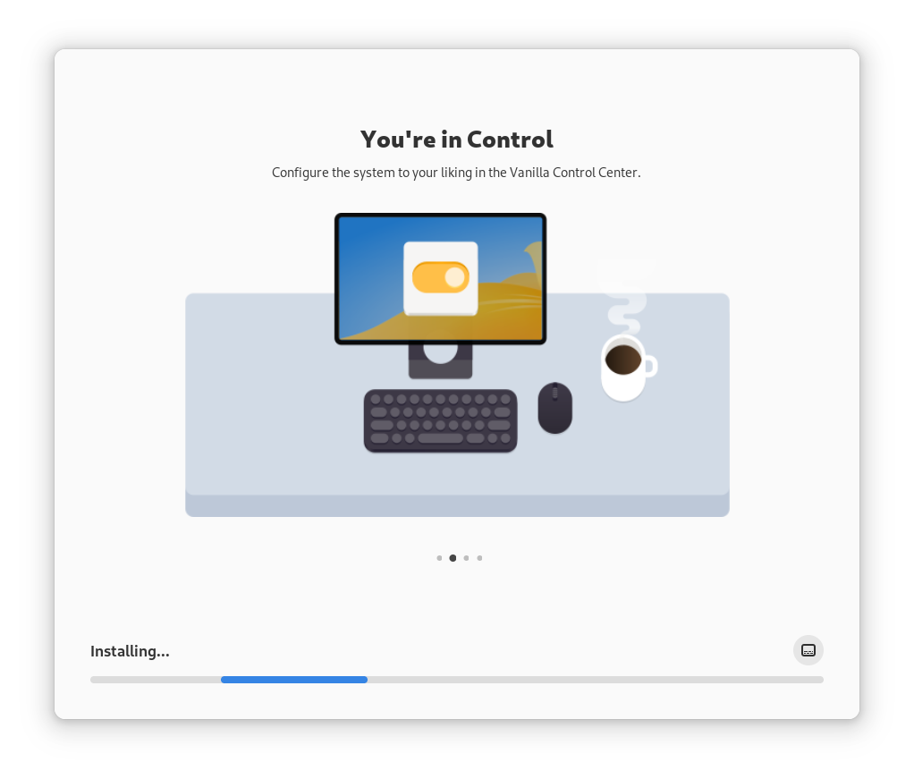

<div align="center">
    
    <h1>Vanilla OS Installer</h1>
    <p>A frontend in GTK 4 and Libadwaita for distinst.</p>
    <hr />
    <a href="https://gitlocalize.com/repo/8114/whole_project?utm_source=badge">  </a>
    <br />
    
</div>


## Build
### Dependencies
- build-essential
- meson
- libadwaita-1-dev
- gettext
- desktop-file-utils
- libgnome-desktop-4-dev
- libgweather-4-dev
- python3-tz

### Build
```bash
meson build
ninja -C build
```

### Install
```bash
sudo ninja -C build install
```

## Run
```bash
vanilla-installer
```

### Using custom recipes
Place a new recipe in `/etc/vanilla-installer/recipe.json` or launch the
utility with the `VANILLA_CUSTOM_RECIPE` environment variable set to the path
of the recipe.
